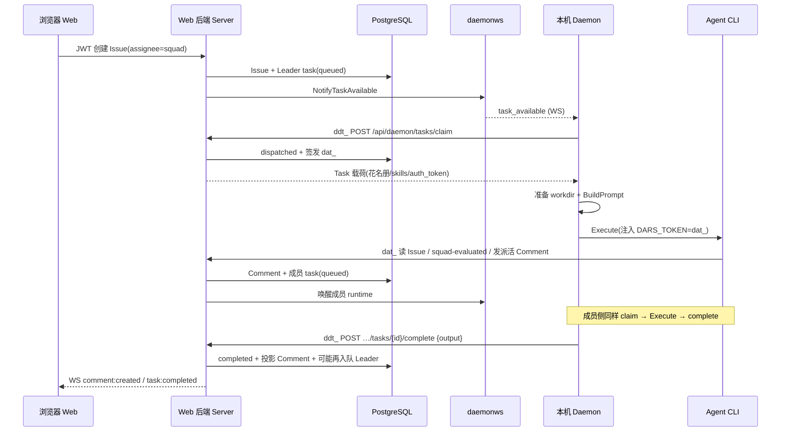

# 小队完成任务：函数调用链

场景：人类创建 Issue（`assignee_type=squad`）→ Leader Claim/执行 → Evaluate + 派活 → 成员执行 → `CompleteTask` 投影评论并回传 → Web 经 WS 收敛。

> **链接约定（Cursor）**：使用**无前导斜杠**的仓库根相对路径。  
> - 错误：`/server/...` → 被当成系统绝对路径，文件不存在 → 提示创建  
> - 错误：`../internal/...` → 按仓库根解析会跑出项目外  
> - 正确：`[打开](server/internal/lightweightapi/task_lifecycle.go)`  
> 请在 **编辑器源码视图** 中对链接 **Cmd/Ctrl + 单击**（比 Markdown 预览更稳）。Mermaid 节点点击在本地预览里通常无效，请用下方表格。

## 流程图（Mermaid）

```mermaid
flowchart TB
  subgraph A["A. 创建任务并入队 Leader"]
    CreateIssue["CreateIssue"]
    resolveIssueAssignee["resolveIssueAssignee"]
    enqueueInitialIssueTask["enqueueInitialIssueTask"]
    CreateInitialIssueTask["CreateInitialIssueTask<br/>(sqlc)"]
    announceQueuedTask1["announceQueuedTask"]
    CreateIssue --> resolveIssueAssignee --> enqueueInitialIssueTask --> CreateInitialIssueTask --> announceQueuedTask1
  end

  subgraph B["B. Leader Claim 与本机执行"]
    ClaimTasks["ClaimTasks"]
    buildClaimedTask["buildClaimedTask"]
    StartTask["StartTask"]
    BuildPrompt["BuildPrompt"]
    BackendExecute["Backend.Execute"]
    ClaimTasks --> buildClaimedTask --> StartTask --> BuildPrompt --> BackendExecute
  end

  subgraph C["C. Evaluate + 派活"]
    RecordSquadLeaderEvaluation["RecordSquadLeaderEvaluation"]
    CreateComment["CreateComment"]
    routeCreatedComment1["routeCreatedComment"]
    resolveCommentTargets["resolveCommentTargets"]
    enqueueCommentTarget["enqueueCommentTarget"]
    announceQueuedTask2["announceQueuedTask"]
    RecordSquadLeaderEvaluation --> CreateComment --> routeCreatedComment1
    routeCreatedComment1 --> resolveCommentTargets --> enqueueCommentTarget --> announceQueuedTask2
  end

  subgraph D["D. 成员完成 → 回传 → Web"]
    MemberExec["成员 ClaimTasks…Execute<br/>(同构 B)"]
    CompleteTask["CompleteTask"]
    writeCompletionProjection["writeCompletionProjection"]
    routeCreatedComment2["routeCreatedComment"]
    reconcileUndeliveredComments["reconcileUndeliveredComments"]
    announceQueuedTask3["announceQueuedTask"]
    publishWS["publish → realtime Hub"]
    MemberExec --> CompleteTask --> writeCompletionProjection --> routeCreatedComment2
    routeCreatedComment2 --> reconcileUndeliveredComments --> announceQueuedTask3 --> publishWS
  end

  announceQueuedTask1 --> ClaimTasks
  BackendExecute --> RecordSquadLeaderEvaluation
  announceQueuedTask2 --> MemberExec

  click CreateIssue "server/internal/lightweightapi/issue.go"
  click resolveIssueAssignee "server/internal/lightweightapi/issue.go"
  click enqueueInitialIssueTask "server/internal/lightweightapi/issue.go"
  click CreateInitialIssueTask "server/lightweight/queries/collaboration_task.sql"
  click announceQueuedTask1 "server/internal/lightweightapi/task_lifecycle.go"
  click ClaimTasks "server/internal/lightweightapi/claim.go"
  click buildClaimedTask "server/internal/lightweightapi/claim.go"
  click StartTask "server/internal/lightweightapi/task_lifecycle.go"
  click BuildPrompt "server/internal/daemon/prompt.go"
  click BackendExecute "server/pkg/agent/agent.go"
  click RecordSquadLeaderEvaluation "server/internal/lightweightapi/squad_evaluation.go"
  click CreateComment "server/internal/lightweightapi/comment.go"
  click routeCreatedComment1 "server/internal/lightweightapi/comment_routing.go"
  click resolveCommentTargets "server/internal/lightweightapi/comment_routing.go"
  click enqueueCommentTarget "server/internal/lightweightapi/comment_routing.go"
  click announceQueuedTask2 "server/internal/lightweightapi/task_lifecycle.go"
  click CompleteTask "server/internal/lightweightapi/task_lifecycle.go"
  click writeCompletionProjection "server/internal/lightweightapi/task_lifecycle.go"
  click routeCreatedComment2 "server/internal/lightweightapi/comment_routing.go"
  click reconcileUndeliveredComments "server/internal/lightweightapi/comment_routing.go"
  click announceQueuedTask3 "server/internal/lightweightapi/task_lifecycle.go"
  click publishWS "server/cmd/server/lightweight_listeners.go"
```



## 可点击函数索引

| 阶段 | 函数 | 仓库路径 | 跳转 | 函数解释 | 在流程中的功能 |
| --- | --- | --- | --- | --- | --- |
| A | `CreateIssue` | [`server/internal/lightweightapi/issue.go`](server/internal/lightweightapi/issue.go) | [打开 #L498](server/internal/lightweightapi/issue.go) | 人类创建 Issue（Run）的 HTTP 入口；校验 `Idempotency-Key`、解析 title/status/assignee。 | **流程起点**：落库 Issue；当 `status=todo` 时触发小队入队，并发布 `issue:created`。 |
| A | `resolveIssueAssignee` | [`server/internal/lightweightapi/issue.go`](server/internal/lightweightapi/issue.go) | [打开 #L266](server/internal/lightweightapi/issue.go) | 把 `assignee_type` + `assignee_id` 解析为可执行的 Agent + Runtime。小队路径会锁 Squad、校验唯一 Leader。 | **确定执行者**：小队指派不会扇出到全员，只解析为 Leader（`leader=true` + `squad_id`）。 |
| A | `enqueueInitialIssueTask` | [`server/internal/lightweightapi/issue.go`](server/internal/lightweightapi/issue.go) | [打开 #L318](server/internal/lightweightapi/issue.go) | 为 Issue 写入首条 `agent_task_queue`，并标记 `first_executed`。 | **首任务入队**：小队场景写入 `is_leader_task=true`，保证先唤醒 Leader 而非成员。 |
| A | `CreateInitialIssueTask`（SQL） | [`server/lightweight/queries/collaboration_task.sql`](server/lightweight/queries/collaboration_task.sql) | [打开文件](server/lightweight/queries/collaboration_task.sql) | sqlc 查询：插入初始队列行（含 `squad_id` / `is_leader_task` / context）。 | **持久化队列**：真正把 Leader Task 写进 PostgreSQL，供后续 Claim。 |
| A/C/D | `announceQueuedTask` | [`server/internal/lightweightapi/task_lifecycle.go`](server/internal/lightweightapi/task_lifecycle.go) | [打开 #L475](server/internal/lightweightapi/task_lifecycle.go) | 入队副作用：广播 `task:queued`，并 `Wakeup.NotifyTaskAvailable` 通知对应 runtime。 | **跨进程唤醒**：在 A（Leader）、C（成员）、D（再唤醒 Leader）三处把「库里有任务」变成 Daemon 可领取。 |
| B | `ClaimTasks` | [`server/internal/lightweightapi/claim.go`](server/internal/lightweightapi/claim.go) | [打开 #L106](server/internal/lightweightapi/claim.go) | Daemon 用 `ddt_` 批量领取任务；调用 `ClaimTasksForRuntimes` 原子 claim。 | **领取执行权**：把 `queued` 变为 `dispatched`，进入本机执行准备。 |
| B | `buildClaimedTask` | [`server/internal/lightweightapi/claim.go`](server/internal/lightweightapi/claim.go) | [打开 #L203](server/internal/lightweightapi/claim.go) | 组装 claim 载荷：解密 env/MCP、加载 skills、签发 `dat_`；附带小队花名册与 instructions。 | **下发执行上下文**：让 Leader/成员拿到 roster、briefing 与 task-scoped 凭证。 |
| B | `StartTask` | [`server/internal/lightweightapi/task_lifecycle.go`](server/internal/lightweightapi/task_lifecycle.go) | [打开 #L203](server/internal/lightweightapi/task_lifecycle.go) | Daemon 在本机就绪后将任务标为 `running`（自 `dispatched` / `waiting_local_directory`）。 | **标记开跑**：与 Claim 和 `Execute` 之间衔接，表示 Agent 进程即将/已经开始。 |
| B | `BuildPrompt` | [`server/internal/daemon/prompt.go`](server/internal/daemon/prompt.go) | [打开 #L35](server/internal/daemon/prompt.go) | 构造 Run/Chat 两类 prompt；Leader 分支附带花名册并要求 `squad evaluate`。 | **生成 Agent 指令**：把角色（Leader/成员）与授权 roster 写进本轮 prompt。 |
| B | `Backend` / `Execute` | [`server/pkg/agent/agent.go`](server/pkg/agent/agent.go) | [打开 #L17](server/pkg/agent/agent.go) | 统一 Agent 后端接口；按 provider 拉起本机编程 CLI 并流式回传。 | **真正干活**：Leader 或成员在本机执行模型/工具调用。 |
| C | `RecordSquadLeaderEvaluation` | [`server/internal/lightweightapi/squad_evaluation.go`](server/internal/lightweightapi/squad_evaluation.go) | [打开 #L65](server/internal/lightweightapi/squad_evaluation.go) | Leader Task Token 记录一次不可变评估：`action` / `no_action` / `failed` → `activity_log`。 | **留下决策痕迹**：派活前固化 Leader 结论，供人类回溯；禁止伪造 actor。 |
| C | `CreateComment` | [`server/internal/lightweightapi/comment.go`](server/internal/lightweightapi/comment.go) | [打开 #L129](server/internal/lightweightapi/comment.go) | 在 Issue 下追加评论（人类或 `dat_` Agent）；写库后调用路由入队。 | **派活载体**：Leader 用结构化 `mention://agent` 评论触发成员任务。 |
| C/D | `routeCreatedComment` | [`server/internal/lightweightapi/comment_routing.go`](server/internal/lightweightapi/comment_routing.go) | [打开 #L210](server/internal/lightweightapi/comment_routing.go) | 评论创建后的入队编排：解析目标 → 逐个入队，返回新建的 queued tasks。 | **评论→任务枢纽**：C 中把派活变成成员队列；D 中把成员结果评论变成 Leader 再入队。 |
| C/D | `resolveCommentTargets` | [`server/internal/lightweightapi/comment_routing.go`](server/internal/lightweightapi/comment_routing.go) | [打开 #L49](server/internal/lightweightapi/comment_routing.go) | 解析 mention、防自触发；成员结果即使无 `@` 也回传 Squad Leader。 | **决定叫醒谁**：路由规则核心——谁该被入队、谁必须跳过。 |
| C | `enqueueCommentTarget` | [`server/internal/lightweightapi/comment_routing.go`](server/internal/lightweightapi/comment_routing.go) | [打开 #L165](server/internal/lightweightapi/comment_routing.go) | 对单个目标：已有活跃 task 则合并评论，否则 `CreateAgentTask`（含 `delegated_from`）。 | **落地成员/跟进任务**：避免重复入队，并保留委派归因。 |
| D | `CompleteTask` | [`server/internal/lightweightapi/task_lifecycle.go`](server/internal/lightweightapi/task_lifecycle.go) | [打开 #L548](server/internal/lightweightapi/task_lifecycle.go) | Daemon 上报成功结束：`running→completed`，投影产物、路由、reconcile、吊销 `dat_`。 | **成员/Leader 收尾入口**：把本机执行结果交回服务端并驱动后续小队循环。 |
| D | `writeCompletionProjection` | [`server/internal/lightweightapi/task_lifecycle.go`](server/internal/lightweightapi/task_lifecycle.go) | [打开 #L485](server/internal/lightweightapi/task_lifecycle.go) | 将 complete 的 `output` 投影为 Issue Comment（或 Chat 消息），并做脱敏。 | **结果落库**：成员产出变成可路由的持久评论，供 Leader 与 Web 可见。 |
| D | `reconcileUndeliveredComments` | [`server/internal/lightweightapi/comment_routing.go`](server/internal/lightweightapi/comment_routing.go) | [打开 #L278](server/internal/lightweightapi/comment_routing.go) | 任务结束后补投递未交付评论；Leader 忙碌时合并或建 follow-up task。 | **防丢评**：保证成员结果在 Leader 仍在跑时不会丢失。 |
| D | WS 桥接（`registerLightweightListeners`） | [`server/cmd/server/lightweight_listeners.go`](server/cmd/server/lightweight_listeners.go) | [打开文件](server/cmd/server/lightweight_listeners.go) | 将 `events.Bus` 上的领域事件扇出到用户侧 `realtime.Broadcaster`。 | **Web 收敛**：`comment:*` / `task:*` / `issue:*` 推到浏览器，UI 刷新 Issue 与小队状态。 |

## 分段说明

### A. 创建任务并入队 Leader

1. [CreateIssue](server/internal/lightweightapi/issue.go) 校验幂等与 body。
2. [resolveIssueAssignee](server/internal/lightweightapi/issue.go) 在 `assignee_type=squad` 时锁小队并解析唯一 Leader。
3. [enqueueInitialIssueTask](server/internal/lightweightapi/issue.go) 写入 `is_leader_task=true` 的队列行（不给每个成员入队）。
4. [announceQueuedTask](server/internal/lightweightapi/task_lifecycle.go) 广播 `task:queued` 并唤醒 Daemon。

### B. Leader Claim 与本机执行

1. [ClaimTasks](server/internal/lightweightapi/claim.go)（`ddt_`）批量 claim。
2. [buildClaimedTask](server/internal/lightweightapi/claim.go) 组装花名册 / skills，签发 `dat_`。
3. [StartTask](server/internal/lightweightapi/task_lifecycle.go) → running。
4. [BuildPrompt](server/internal/daemon/prompt.go)（Leader 分支要求 `squad evaluate`）→ [Backend.Execute](server/pkg/agent/agent.go)。

### C. Evaluate + 派活

1. [RecordSquadLeaderEvaluation](server/internal/lightweightapi/squad_evaluation.go)（仅 Leader Task Token）。
2. [CreateComment](server/internal/lightweightapi/comment.go) 带 `mention://agent/<uuid>`。
3. [routeCreatedComment](server/internal/lightweightapi/comment_routing.go) → [resolveCommentTargets](server/internal/lightweightapi/comment_routing.go) → [enqueueCommentTarget](server/internal/lightweightapi/comment_routing.go)。
4. 再次 [announceQueuedTask](server/internal/lightweightapi/task_lifecycle.go) 唤醒成员 runtime。

### D. 成员完成 → 回传 → Web

1. 成员侧重复 B（非 Leader prompt）。
2. [CompleteTask](server/internal/lightweightapi/task_lifecycle.go) → [writeCompletionProjection](server/internal/lightweightapi/task_lifecycle.go)（output → Comment）。
3. [routeCreatedComment](server/internal/lightweightapi/comment_routing.go)：成员结果即使无 `@` 也回传 Leader。
4. [reconcileUndeliveredComments](server/internal/lightweightapi/comment_routing.go) 防丢评。
5. `publish` → [lightweight_listeners](server/cmd/server/lightweight_listeners.go) → 用户 WS → Web UI。

## 谁在处理：Web 后端 vs Daemon

两个进程分工很清晰：

| 角色 | 进程 / 代码位置 | 职责 |
| --- | --- | --- |
| **Web 后端（Server）** | `cmd/server` + `internal/lightweightapi` | 权威状态：Issue / Comment / `agent_task_queue` / Token；鉴权；入队与路由；把结果投影回 DB；向浏览器推 WS |
| **Daemon** | `dars daemon` → `internal/daemon` + `pkg/agent` | 本机执行：被唤醒后 claim 任务、准备工作目录、跑 Agent CLI、把进度/结果 **HTTP 回调** 给 Server |
| **浏览器 Web** | `apps/web` + `packages/core` | 调人类 API 创建 Issue/看评论；订阅 `GET /ws` 收实时事件（**不**直接跟 Daemon 通信） |

### 按阶段归属

| 阶段 | Server（Web 后端） | Daemon |
| --- | --- | --- |
| A 创建/入队 | `CreateIssue` → 解析小队 → 写队列 → `announceQueuedTask` | 无（仅被唤醒） |
| B Claim/执行 | `ClaimTasks` / `StartTask` 改队列状态、签发 `dat_` | 调 claim；`BuildPrompt`；`Backend.Execute` 跑本机 CLI |
| C Evaluate/派活 | `RecordSquadLeaderEvaluation`、`CreateComment`、评论路由入队 | Agent 通过 **`dat_`** 调上述 API（Daemon 注入 token，请求仍打到 Server） |
| D 完成回传 | `CompleteTask` 投影评论、回传 Leader、publish WS | 调 `POST …/complete`（`ddt_`）上报 output |
| Web UI | `events.Bus` → `realtime` → `/ws` | 不参与 |

要点：**业务真相只在 Server DB**。Daemon 不持有小队状态机，只执行被 claim 到的任务并回调。

### 数据如何交互



### 三条通道

1. **人类 ↔ Server（JWT / PAT）**  
   创建小队、建 Issue、浏览评论。路径如 `POST /api/issues`，带头 `X-Workspace-ID`。

2. **Daemon ↔ Server（`ddt_` + 可选 `/api/daemon/ws`）**
   - **下行唤醒**：Server `announceQueuedTask` → `daemonws` 推 `task_available` / `pending_work`（可经 Redis 跨节点）。  
   - **上行控制面**：`claim` / `start` / `progress` / `messages` / `complete` / `fail` / `heartbeat`。  
   - Claim 响应里带齐执行包：agent 配置、skills、**小队花名册**、`auth_token`（`dat_`）。

3. **Agent 子进程 ↔ Server（`dat_`，task-scoped）**
   Daemon 把 claim 下发的 token 注入环境（如 `DARS_TOKEN`）。Agent 用它访问 **task-scoped** 人类路由：读 Issue、发 Comment、`squad-evaluated`、有限字段更新。
   **不能**当 Daemon 用：进度与 complete 仍由 Daemon 用 `ddt_` 回调。

### 关键载荷（交互里传什么）

| 方向 | 内容 |
| --- | --- |
| Server → Daemon（claim 响应） | `task_id`、`runtime_id`、`issue_id`、`squad` 花名册、`is_leader_task`、skills、`auth_token`、context |
| Daemon → Server（complete） | `output`（最终文本）、`session_id` / `work_dir` 等；Server 投影为 Comment |
| Server → Browser（WS） | `issue:*` / `comment:created` / `task:queued|dispatch|completed` 等事件帧 |
| Agent → Server（派活） | Comment body 含 `mention://agent/<uuid>`；Server 解析后给成员入队 |

### 一句话

**Server 管队列与真相，Daemon 管本机跑 Agent，两边用 `ddt_`/`dat_` + Daemon WS 交换；浏览器只跟 Server 的 HTTP/用户 WS 说话。**

## 线性调用链（文本）

```text
CreateIssue
  → resolveIssueAssignee
  → enqueueInitialIssueTask
  → CreateInitialIssueTask
  → announceQueuedTask
→ ClaimTasks → buildClaimedTask → StartTask → BuildPrompt → Backend.Execute
→ RecordSquadLeaderEvaluation
→ CreateComment
  → routeCreatedComment → resolveCommentTargets → enqueueCommentTarget
  → announceQueuedTask
→ (成员 ClaimTasks…Execute)
→ CompleteTask
  → writeCompletionProjection
  → routeCreatedComment
  → reconcileUndeliveredComments
  → announceQueuedTask
  → publish / realtime → Web
```

## 相关文档

- 产品说明：[/apps/docs/content/docs/squads.mdx](apps/docs/content/docs/squads.mdx)
- 目录导读：[/apps/docs/content/docs/developers/server-directory.mdx](apps/docs/content/docs/developers/server-directory.mdx)
- 架构：[/apps/docs/content/docs/developers/architecture.mdx](apps/docs/content/docs/developers/architecture.mdx)
